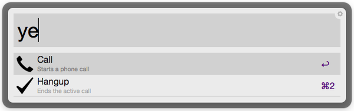
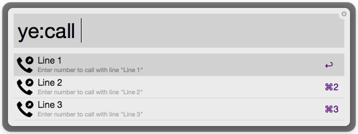

# Yealink IP Phone Workflow [[for Alfred](https://www.alfredapp.com/)]

A workflow for your Yealink ip phone that will rock your world  (requires Powerpack license).

## Supported Phones

Maybe other Yealink phones with [Action URI](http://www.yealink.ae/assets/V60-Documents/Action-URL-URI.pdf) functionality are also supported.

- [SIP-T41P](http://www.yealink.com/DE/product_info.aspx?ProductsCateID=1035&parentcateid=1396&cateid=1035&BaseInfoCateId=1035&Cate_Id=1035&index=2)
- [SIP-T42G](http://www.yealink.com/DE/product_info.aspx?ProductsCateID=1034&parentcateid=1396&cateid=1034&BaseInfoCateId=1034&Cate_Id=1034&index=2)
- [SIP-T46G](http://www.yealink.com/DE/product_info.aspx?ProductsCateID=1032&parentcateid=1396&cateid=1032&BaseInfoCateId=1032&Cate_Id=1032&index=2)
- [SIP-T48G](http://www.yealink.com/DE/product_info.aspx?ProductsCateID=1217&parentcateid=1396&cateid=1217&BaseInfoCateId=1217&Cate_Id=1217&index=2)
- [SIP-VP49G](http://www.yealink.com/DE/product_info.aspx?ProductsCateID=1408&parentcateid=1396&cateid=1408&BaseInfoCateId=1408&Cate_Id=1408&index=2)

## Installation

After downloading, simply double-click to install the workflow in Alfred.

**[Download](https://github.com/andreas-weber/yealink-workflow/zipball/master/Yealink.alfredworkflow)**

After installation open the workflow folder, create the configuration file `config.php` and update the file with your data. You can use `config.php.dist` as boilerplate. When you're finished, you can start using the workflow by typing `yl`.

## Usage

The follwing triggers are supported:

Trigger        | Action
---------------| ------
`yl`           | Shows the main menu
`yl:call`      | Starts a call
`yl:hangup`    | Ends a call

To call directly from Alfred's contacts you can configure a [contact action trigger](https://www.alfredapp.com/help/workflows/triggers/contact-action/).

## Contribute

Contributions to this project are always welcome. If you would like to help take a look at the list of [issues](https://github.com/andreas-weber/yealink-workflow/issues).

All code contributions - including those of people having commit access - must go through a pull request and must be approved by a core developer before being merged. This is to ensure proper review of all the code. To ensure a consistent code base, you should make sure the code follows [PSR-1](http://www.php-fig.org/psr/psr-1) and [PSR-2](http://www.php-fig.org/psr/psr-2).

Fork the project, create a feature branch, and send a pull request.

Thanks to everyone who has [contributed](https://github.com/andreas-weber/yealink-workflow/graphs/contributors) to this project.

## License

This project is licensed under the MIT License - see the LICENSE file for details.